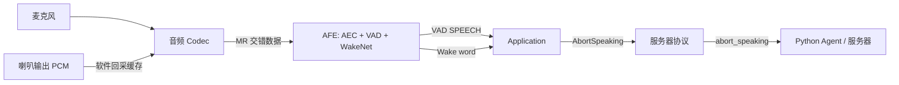

# ElectronBot 对话打断（Barge-In）实施方案

> 适用设备：ElectronBot 对话版（ESP32-S3，无头无手脚）
> 目标固件：xiaozhi-esp32 仓库 `electron-bot` 板型
> 文档状态：方案已实施（源码修改已完成），真机编译与硬件验证待执行

## 0. 当前实施进度

- ✅ 保底备份：原文件已备份到 `backup/before-bargein/`
- ✅ `PROJECT_VER` 改为 `99.0.0`（防止官方 OTA 覆盖）
- ✅ BOOT 键打断：`electron_bot.cc` 已在 speaking 状态调用 `AbortSpeaking()`
- ✅ 新增 `electron_bot_audio_codec.h/.cc`（软件回采 AEC）
- ✅ `config.h` 输出采样率改为 16kHz
- ✅ `config.json` 注入 `CONFIG_USE_DEVICE_AEC=y`、`CONFIG_USE_AFE_WAKE_WORD=y`、`CONFIG_WAKE_WORD_DETECTION_IN_LISTENING=y`
- ✅ `Kconfig.projbuild` 放行 ElectronBot 设备端 AEC
- ✅ 已用 ESP-IDF v6.0.2 编译通过，产物已拷回 `build/merged-binary.bin`
- ⏳ 真机测试矩阵待执行

## 1. 验收标准（必须全部通过）

- [ ] 播放 TTS 时，用户喊“你好小智”可以打断播报，并进入聆听
- [ ] 播放 TTS 时，用户开口说话可以直接打断播报（无需唤醒词）
- [ ] 机器人自己播放 TTS 时，不会被自己的声音误打断（设备端 AEC 生效）

## 2. 现状与根因

### 2.1 为什么现在“完全没有打断”

1. 实时“开口即打断”依赖设备端回声消除（AEC），而 ElectronBot 的音频 codec（`NoAudioCodecSimplex`）没有播放回采参考：`input_reference_ = false`，AFE 检测到后会拒绝启用 AEC。
2. Kconfig 的 `USE_DEVICE_AEC` 依赖板型列表里没有 `BOARD_TYPE_ELECTRON_BOT`，菜单里根本开不了这个选项。
3. 采样率不一致：麦克风 16kHz、喇叭 24kHz，软件回采需要两者一致或做降采样。
4. 唤醒词部分：仓库默认配置已带 `CONFIG_SR_WN_WN9_NIHAOXIAOZHI_TTS=y`（“你好小智”），固件在 `speaking` 状态也已保留 AFE 唤醒词检测，所以“喊唤醒词打断”主要是配置/模型确认问题，不是代码缺失。

### 2.2 关键代码位置

| 文件 | 作用 |
| --- | --- |
| `main/boards/electron-bot/electron_bot.cc` | 板级初始化、BOOT 键、音频 codec 装配 |
| `main/boards/electron-bot/config.h` | 引脚与采样率配置 |
| `main/audio/codecs/no_audio_codec.h/.cc` | 当前音频 codec（无回采参考） |
| `main/audio/engines/afe_audio_engine.cc` | AFE 配置：AEC、VAD、唤醒词 |
| `main/application.cc` | 说话/聆听状态切换、`AbortSpeaking()` |
| `main/Kconfig.projbuild` | 编译选项与板型依赖 |
| `main/boards/espressif/esp32-s3-box-lite/box_audio_codec_lite.cc` | 软件回采 AEC 的参考实现 |

## 3. 总体方案



核心思路：把“要发给喇叭的 PCM”同时缓存为 AEC 参考信号，让 AFE 在播放时能区分“用户声音”和“机器人自己的声音”，从而安全地实时检测人声并打断。

## 4. 分阶段实施方案

### 阶段 A：唤醒词打断（配置确认，优先做）

**目标**：播放时喊“你好小智”能打断。

**改动范围**：编译配置，基本不改代码。

1. 确认编译配置：
   - `USE_AFE_WAKE_WORD=y`
   - `CONFIG_SR_WN_WN9_NIHAOXIAOZHI_TTS=y`
   - `SPIRAM=y`（ESP32-S3 默认需要 PSRAM 跑 AFE）
2. 检查固件启动日志：
   - 应能看到 AFE 初始化、WakeNet 模型加载成功。
3. 播放 TTS 时喊“你好小智”，串口应出现：
   ```text
   Wake word detected
   Abort speaking
   ```

> 固件在 `kDeviceStateSpeaking` 状态下已经调用 `EnableWakeWordDetection(IsAfeWakeWord())`（见 `main/application.cc`），所以只要模型和配置在，此功能无需新增代码。

### 阶段 B：按键打断（保底，建议同步做）

**目标**：按 BOOT 键随时打断。

**改动文件**：`main/boards/electron-bot/electron_bot.cc`

**改动逻辑**：`InitializeButtons()` 的 BOOT 键回调里增加：

```cpp
boot_button_.OnClick([this]() {
    auto& app = Application::GetInstance();
    if (app.GetDeviceState() == kDeviceStateStarting) {
        EnterWifiConfigMode();
        return;
    }
    if (app.GetDeviceState() == kDeviceStateSpeaking) {
        app.AbortSpeaking(kAbortReasonNone);
        return;
    }
    app.ToggleChatState();
});
```

`Application::AbortSpeaking()` 已在 `main/application.h` 公开，可直接调用。

### 阶段 C：实时语音打断 + 设备端 AEC（核心）

#### C.1 新增 ElectronBot 板级音频 codec（软件回采）

**推荐做法**：不要直接改公共 `NoAudioCodecSimplex`，而是在 `main/boards/electron-bot/` 下新增：

```text
electron_bot_audio_codec.h
electron_bot_audio_codec.cc
```

继承 `NoAudioCodecSimplex`，并实现软件回采：

- 构造函数：
  - `input_reference_ = true`
  - `input_channels_ = 2`（输入格式变为 `MR`：Mic + Reference）
  - 分配参考缓冲 `ref_buffer_`（参考 ESP-BOX-Lite：`960 * 2` 起步）
- 重写 `Write(const int16_t* data, int samples)`：
  - 调用父类逻辑写喇叭；
  - 同时把同一份 PCM 拷入 `ref_buffer_`（环形游标，溢出时保留最新数据）。
- 重写 `Read(int16_t* dest, int samples)`：
  - 读取麦克风 `samples / 2` 个样本；
  - 按 `[mic, ref]` 交错写入 `dest`；
  - `ref_buffer_` 为空时补 0。

参考实现：`main/boards/espressif/esp32-s3-box-lite/box_audio_codec_lite.cc`（注释明确写了“板子不支持硬件回采，采用缓存播放缓冲来实现回声消除”）。

#### C.2 采样率对齐

ElectronBot 当前是 16kHz 输入 / 24kHz 输出。AFE 的参考通道必须与麦克风同采样率。

**推荐（简单）**：把 `main/boards/electron-bot/config.h` 的：

```c
#define AUDIO_OUTPUT_SAMPLE_RATE 24000
```

改为：

```c
#define AUDIO_OUTPUT_SAMPLE_RATE 16000
```

**备选（保留 24kHz）**：在回采路径中做 24k→16k 降采样，代码量更大，建议后续再优化。

#### C.3 放行设备端 AEC

**改动文件**：`main/Kconfig.projbuild`

把 `BOARD_TYPE_ELECTRON_BOT` 加入 `USE_DEVICE_AEC` 的 `depends` 列表，然后编译时开启：

```text
CONFIG_USE_DEVICE_AEC=y
```

开启后，`AfeAudioEngine` 会：

- 检测到 `input_reference() == true`；
- 以 `MR` 输入格式创建 AFE；
- 启用 AEC（`aec_mode`、`aec_nlp_level`）；
- 播放时持续保留 VAD 检测。

#### C.4 切换 ElectronBot 使用新 codec

**改动文件**：`main/boards/electron-bot/electron_bot.cc`

`GetAudioCodec()` 中把 `NoAudioCodecSimplex` 换成新的板级 codec（构造参数传开启软件回采的开关），并确保 `input_reference` 生效。

#### C.5 调整 VAD / AEC 参数

**改动文件**：`main/audio/engines/afe_audio_engine.cc`

需要实测调参的参数：

```cpp
afe_config->aec_mode        = AEC_MODE_VOIP_HIGH_PERF;
afe_config->aec_nlp_level   = AEC_NLP_LEVEL_VERYAGGR;
afe_config->vad_mode        = VAD_MODE_0;
afe_config->vad_min_noise_ms = 100;
```

建议第一版保持默认，烧录后根据日志和实际体验逐项调整：

- 误打断多 → 提高 `vad_min_noise_ms`、调低 VAD 灵敏度；
- 打断不灵敏 → 降低 `vad_min_noise_ms`、调高灵敏度；
- 自己声音消不掉 → 调整回采参考增益/时延，检查 AEC 参数。

### 阶段 D：防误打断验证与调优

AEC 生效后必须验证“机器人自己播放不误打断”：

- 播放一段 TTS，全程不开口：不应出现 `VAD_SPEECH → Abort speaking`；
- 播放 TTS 时开口说话：应快速出现 VAD 变化并打断；
- 播放音乐/提示音时说话：应能打断且不把音乐当成人声。

## 5. 涉及文件清单

| 文件 | 改动类型 | 说明 |
| --- | --- | --- |
| `CMakeLists.txt` | 修改 | `PROJECT_VER` 改为 `99.0.0`，防止官方 OTA 覆盖 |
| `main/boards/electron-bot/electron_bot.cc` | 修改 | BOOT 键打断、换用新 codec |
| `main/boards/electron-bot/config.h` | 修改 | 输出采样率改为 16k（或保留 24k 做降采样） |
| `main/boards/electron-bot/electron_bot_audio_codec.h/.cc` | 新增 | 软件回采 codec |
| `main/boards/electron-bot/config.json` | 修改 | 注入 `CONFIG_USE_DEVICE_AEC=y`、`CONFIG_USE_AFE_WAKE_WORD=y`、`CONFIG_WAKE_WORD_DETECTION_IN_LISTENING=y` |
| `main/Kconfig.projbuild` | 修改 | `USE_DEVICE_AEC` 加入 ElectronBot |
| `main/audio/engines/afe_audio_engine.cc` | 修改 | VAD/AEC 参数调优 |
| `sdkconfig.defaults.esp32s3` | 确认 | 唤醒词模型已默认开启 |

## 6. 验证方案

> Windows 构建注意：本仓库路径过长会导致组件管理器复制失败。验证时先把仓库复制到短路径（如 `C:\tmp\eb`）编译，再把 `merged-binary.bin` 拷回项目目录；另外 Windows 下 `build.py` 调用 `idf.py` 需要 `idf.py.exe` 包装（可在 PATH 前置一个名为 `idf.py` 的 PE 副本）。

### 6.1 编译与烧录

```bash
python scripts/build.py electron-bot --name electron-bot
```

产物：`build/merged-binary.bin`，使用 ESP Launchpad 从 `0x0` 烧录。

### 6.2 串口日志关键字

| 期望行为 | 日志关键字 |
| --- | --- |
| AEC 已启用 | `AEC` / `MR` 输入格式 / 不再出现 `Device AEC requires a playback reference channel` |
| 唤醒词打断 | `Wake word detected` → `Abort speaking` |
| 实时语音打断 | `VAD_SPEECH` → `Abort speaking` |
| 未误打断 | 播放全程无 `Abort speaking` |

### 6.3 功能测试矩阵

| 测试项 | 操作 | 期望结果 |
| --- | --- | --- |
| 唤醒词打断 | TTS 播放中喊“你好小智” | 停止播报，进入聆听 |
| 实时打断 | TTS 播放中直接说话 | 快速停止播报，进入聆听 |
| 防误触 | TTS 播放中不说话 | 不停止，不进入聆听 |
| 按键打断 | TTS 播放中按 BOOT | 停止播报 |
| 打断后响应 | 打断后说新问题 | 正常重新回答 |

## 7. 风险与回退

- **公共 codec 影响其他板子**：通过新增板级 codec 隔离，避免改公共 `NoAudioCodecSimplex`。
- **输出采样率降到 16k 影响音质**：语音对话可接受；如果不行，改用 24k→16k 降采样。
- **回采时序不对导致误打断/消不掉**：参考 `box_audio_codec_lite.cc` 的环形缓冲实现，实测调整参考增益。
- **回退方案**：所有改动集中在少数文件，保留 git diff，随时可还原；第一阶段只做配置和按键打断，不影响主流程。

## 8. 官方小智服务端兼容性与保底方案

### 8.1 结论：修改固件后仍可使用官方小智服务端

可以。设备烧录的是“本地固件”，服务端连接由固件里的 OTA 地址和板型标识决定：

- 我们的修改只涉及设备本地（软件回采 codec、AEC、按键打断、唤醒词确认），不改变协议消息；
- `config.json` 的板型标识保持 `type=electron-bot`、`name=electron-bot`，官方服务端仍按 electron-bot 识别设备；
- `abort_speaking`、`start listening`、`wake word detected` 都是参考协议已有消息，官方服务端支持；
- MCP 工具列表不变，音量、亮度、状态查询等功能不受影响。

> 平台“烧录”页本质是跳转官方 ESP Launchpad，通过浏览器直连串口写 Flash，不会修改设备上的服务器配置，因此烧录后设备仍按原 OTA 地址连接小智服务端。

### 8.2 必须防止 OTA 覆盖修改版

固件启动时会向 OTA 服务端检查新版本（`main/ota.cc`）。如果官方 electron-bot 固件版本高于本地固件，设备会自动下载官方固件并覆盖你的修改。

**测试前必须做**：把根目录 `CMakeLists.txt` 的版本号改成高于官方版本，例如：

```cmake
set(PROJECT_VER "99.0.0")
```

这样 OTA 版本比较会认为本地已是最新，不会自动升级覆盖。

> 例外：如果服务端下发 `force=1`（强制升级），固件会无视版本号强制安装。官方服务端一般不会对测试设备启用，但存在理论风险。

### 8.3 保底方案（回退与恢复）

1. **先备份原固件**：烧录修改版之前，把当前可用的 `merged-binary.bin`（官方版或上一版）复制到安全目录，例如：

   ```text
   D:\vibe coding project\embedded\Tabletop conversational robot\new version 1.1\backup\merged-binary-official.bin
   ```

2. **随时可回刷**：如果修改版有问题，用 ESP Launchpad 重新选择备份的 `merged-binary.bin` 从 `0x0` 烧录即可恢复，不需要电脑装 ESP-IDF。

3. **保留官方 OTA 地址**：不要为了测试把 `CONFIG_OTA_URL` 改空或改错，否则设备激活拿不到服务器配置；保持默认 `https://api.tenclass.net/xiaozhi/ota/`。

4. **修改前留 git diff**：对 `electron_bot.cc`、`config.h`、`Kconfig.projbuild`、`afe_audio_engine.cc` 等文件的改动保留记录，方便定位问题和还原。

5. **被强制升级/变砖后的恢复**：按住 BOOT 键进入下载模式（或自动进入），用 ESP Launchpad 重刷备份固件即可，Flash 内容可完全覆盖。

6. **测试期间建议流程**：
   - 备份原固件；
   - 修改代码并 bump 版本号；
   - 编译 → ESP Launchpad 烧录；
   - 连官方服务测试三项打断；
   - 有问题就回刷备份，不依赖服务器端任何操作。

## 9. Agent 提示词（执行时直接使用）

### 8.1 C++ 实现 Agent 提示词（主任务）

```text
你负责在 xiaozhi-esp32 仓库中为 ElectronBot（ESP32-S3，无头无手脚）实现“对话打断”功能。

验收标准（必须全部满足）：
1. 播放 TTS 时喊“你好小智”能打断；
2. 播放 TTS 时开口说话能直接打断；
3. 机器人自己播放时不误打断（设备端 AEC 生效）。

必须先阅读并遵守仓库根目录 AGENTS.md。
先阅读以下关键文件，再开始实现：
- main/boards/electron-bot/electron_bot.cc
- main/boards/electron-bot/config.h
- main/audio/codecs/no_audio_codec.h/.cc
- main/audio/engines/afe_audio_engine.cc
- main/application.cc
- main/Kconfig.projbuild
- main/boards/espressif/esp32-s3-box-lite/box_audio_codec_lite.cc（软件回采参考实现）

【重要：必须使用子代理辅助工作】
- 必须将独立任务拆给子代理并行处理，例如：
  * 子代理 A：审计 Kconfig 与编译配置，确认唤醒词/AEC/PSRAM 开关；
  * 子代理 B：实现 ElectronBot 板级软件回采 codec；
  * 子代理 C：编写并执行编译与静态验证；
  * 子代理 D：根据日志和测试结果做参数调优。
- 主 agent 负责汇总、决策、合并结果，不得跳过子代理的验证结论。

【重要：必须使用 loop 模式反复验证代码可行性】
- 每次代码改动后必须进入 编译 → 检查 → 修复 → 再编译 的循环；
- 循环直到：编译通过、日志关键字符合预期、三项验收标准全部通过；
- 不允许一次性写完就交付，必须给出每一轮验证的证据（命令输出、日志片段、测试结果）。

实现约束：
- 不要直接修改公共 NoAudioCodecSimplex 影响其他板子，优先新增 ElectronBot 板级 codec；
- 软件回采参考必须与麦克风同采样率（16kHz），可先改输出采样率或实现降采样；
- 设备端 AEC 开关必须在 Kconfig 中为 ElectronBot 放行；
- 改动要小、可回退，完成后输出：改动文件清单、验证日志、剩余风险。
```

### 8.2 编译与验证 Agent 提示词（子代理）

```text
你是编译验证子代理。任务：验证 ElectronBot 打断改造的代码可行性。

必须使用 loop 模式：重复执行 编译 → 收集日志 → 报告失败 → 修复建议 → 重新编译，直到通过。

步骤：
1. 检查 ESP-IDF 环境（优先 v6.0.2）；
2. 执行 python scripts/build.py electron-bot --name electron-bot；
3. 检查 build/merged-binary.bin 是否生成；
4. 搜索构建日志，确认以下配置生效：
   - CONFIG_USE_AFE_WAKE_WORD=y
   - CONFIG_USE_DEVICE_AEC=y
   - CONFIG_SR_WN_WN9_NIHAOXIAOZHI_TTS=y
   - CONFIG_SPIRAM=y
5. 静态检查改动文件是否有编译错误、锁竞争、缓冲区越界；
6. 输出：编译结论、验证证据、失败原因与修复建议。

如果没有硬件，必须明确说明“仅通过编译/静态验证，仍需真机验证”，不得声称已通过功能验收。
```

### 8.3 真机验证 Agent 提示词（有硬件时）

```text
你是真机验证子代理。任务：按以下矩阵验证 ElectronBot 打断功能。

必须使用 loop 模式：每轮烧录后执行测试矩阵，失败则收集串口日志，给出修复建议，重新验证，直到全部通过。

测试矩阵：
1. TTS 播放中喊“你好小智” → 期望停止并进入聆听；
2. TTS 播放中直接说话 → 期望快速打断；
3. TTS 播放中不说话 → 期望不误打断；
4. 按 BOOT 键 → 期望停止播报；
5. 打断后重新提问 → 期望正常应答。

串口日志需要抓取：
- Wake word detected / Abort speaking
- VAD_SPEECH / VAD_SILENCE
- Device AEC requires a playback reference channel（出现即失败）
- AFE 初始化日志（确认 MR 输入与 AEC）

输出：每项测试 通过/失败、日志证据、调参建议。
```

## 10. 执行顺序建议

1. 阶段 A：确认唤醒词配置（最快，可能零代码）；
2. 阶段 B：加 BOOT 键打断（保底）；
3. 阶段 C：软件回采 AEC + 实时打断（核心）；
4. 阶段 D：防误打断实测调参；
5. 由伙伴 Python 侧确认 `abort_speaking` 处理与打断后重新应答。
